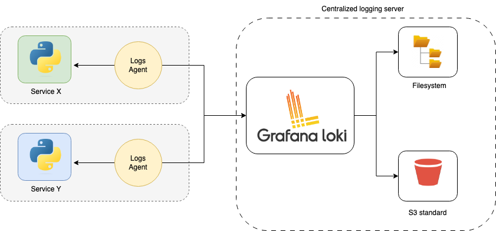

## Overview

Logging is a foundational component of observability (along with metrics and tracing), offering a detailed narrative of activities within a system. It involves capturing and storing records of events or messages generated by a system during its operation. These logs serve as a detailed chronicle of what has happened within the system, containing valuable information about errors, warnings, user interactions, and other relevant activities.

The 12-factor app methodology suggests a centralized logging approach - keeping logs in a centralized location using a standardized logs format. This aggregation gives a holistic view of the system's health and behavior. When issues arise, centralized logs make troubleshooting and debugging problems easier. Instead of checking individual logs on each instance or component, developers, and administrators can examine a centralized repository, making it more efficient to identify and resolve issues. As applications scale, managing logs becomes more challenging. Centralized logging systems are designed to scale with the growth of the application, ensuring that log data can be efficiently stored and accessed, even in large-scale, distributed environments.

# Architecture
